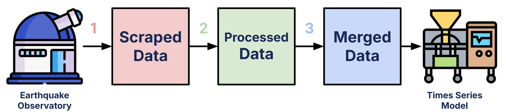

# SmartQuake

SmartQuake is a research project aimed at predicting earthquakes on a global scale using the latest machine learning technologies. It compiles data from 14 global datasets, creating a robust dataset that can be leveraged for future earthquake prediction research.


**SmartQuake Data Pipeline**

1. Visit the data_scraping/ folder
2. Visit the data_processing/ folder
3. Visit the data_merging/ folder

---

## Dataset Checkpoints

Access the dataset at various stages of acquisition:

- [data_scraping](https://drive.google.com/drive/folders/1okZ_2QW58CqQwPA8JIDIwmaBbcOtLIMp?usp=sharing)
- [data_processing](https://drive.google.com/drive/folders/1CnXaP9KgUxgQrrreYt3s1MSbCJKHmCQy?usp=sharing)
- [data_merging](https://drive.google.com/drive/folders/1GUvjtBC2jBqHQGbAVy4rqSAd9fXe3sxT?usp=sharing)

---

## Table of Contents

1. [Data Scraping](#data-scraping)
2. [Data Processing](#data-processing)
3. [Data Merging](#data-merging)
4. [Data Source](#data-source)

---

# Data Scraping

### Overview

This step involves scraping earthquake data from various sources, including text files, web pages, and PDFs. It utilizes **BeautifulSoup** for web scraping, **Pandas** for data manipulation, and **Tabula** for PDF data extraction.

### Installation

1. From Google Drive, download the raw datasets and place them under the `dataset/data_scraping/.../raw` folder.
2. Install the required dependencies:

   ```bash
   pip install -r requirements.txt
   ```

3. Run the scraping script:

   ```bash
   python dataset/main.py
   ```

   The scraped datasets will be saved under `dataset/data_scraping/.../clean`.

### Usage

1. **Initialization**: Create an instance of the `Scraper` class with parameters:
   - `input_path`: Path to the input file (for text and PDF sources).
   - `output_path`: Path to save the output CSV.
   - `url`: Webpage URL to scrape (for web sources).
   - `start_time` and `end_time`: Date range for filtering data.
   - `header`: Column names for the output CSV.
   - `separator`: Character for separating data in text files (default is space).

2. **Scraping**:
   - `find_quakes_txt(num_skips=0)`: For text files. `num_skips` skips initial lines.
   - `find_quakes_web()`: For web pages. Scrapes data based on the body tag and predefined header.

3. **Example**:

   ```python
   scraper = Scraper(input_path='input.txt', output_path='output.csv', url='http://example.com', header=['Date', 'Magnitude', 'Location'])
   scraper.find_quakes_txt(num_skips=1)
   scraper.find_quakes_web()
   ```

---

# Data Processing

### Overview

Data processing is the second step in the SmartQuake data pipeline. After scraping the datasets, they are compiled into a standardized format where all datasets share the same columns.

### Data Standardization

Processed earthquake CSV files will contain the following columns:

1. **Timestamp**: Stored as a `pd.Timestamp` string in UTC (format: YYYY-MM-DD HH:MM:SS.millisecond+00:00).
2. **Magnitude**: Moment magnitude (Mw).
3. **Latitude**: Range within [-90, 90].
4. **Longitude**: Range within [-180, 180].
5. **Depth**: Depth in kilometers (optional, may be `None` for older records).

All datasets are sorted chronologically and contain no duplicates.

### File Organization

- **data_processor.py**: Contains the `DataProcessor` class for standardized processing.
- **run_processor.py**: Runs the `DataProcessor` on all scraped datasets.
- **processed/**: Folder containing the processed output datasets (CSVs).

### Running Data Processing

1. Ensure that all `clean` datasets exist in the `dataset/data_scraping/.../clean` folder.
2. Verify that the `processed/` folder exists in `data_processing/`.
3. Run `run_processor.py`:

   ```bash
   python data_processing/run_processor.py
   ```

4. After completion, check for the processed CSVs in the `processed/` folder before proceeding to the merging step.

---

# Data Merging

The merging process combines all processed datasets into a single file for machine learning model input. This step preserves the same columns and ensures chronological order without duplicates.

### File Organization

- **helper.py**: Contains helper functions for merging.
- **merge.py**: Merges non-USGS/SAGE datasets into `Various-Catalogs.csv`.
- **usgs_pre_1950/**: Folder containing scripts for USGS data processing and merging.
- **final/**: Folder containing `usgs_sage_various_merge.py`, which merges all datasets into `Completed-Merge.csv`.

### Running Merge

1. **Compile Processed Datasets**: Ensure all processed datasets are in `data_processing/processed/` (excluding USGS/SAGE datasets).
2. **First Merge**: Run `merge.py` to create `Various-Catalogs.csv` and move it to the folder `data_merging/final`.
3. **USGS Data Processing**:
   - Visit the Google Drive and directly download [`USGS_SAGE_Merged.csv`](https://drive.google.com/file/d/1vZxxrXIYR7K7YWcuJUe4HGYJH8vDCTpX/view?usp=drive_link). Store the file in `data_merging/final/` for the next step.
4. **Final Merge**: Run `usgs_sage_various_merge.py` to merge all datasets into `Completed-Merge.csv`.

---

# Data Source

| Dataset       | Status      | Link                                                                         | Additional Comments                                |
|---------------|-------------|------------------------------------------------------------------------------|---------------------------------------------------|
| Argentina     | good        | [Link](https://doi.org/10.31905/YTIR1IED)                                    | Downloaded Manually |
| Canada        | good        | [Link](https://earthquakescanada.nrcan.gc.ca/stndon/NEDB-BNDS/bulletin-en.php) | Downloaded Manually |
| Japan         | good        | [Link](http://www-solid.eps.s.u-tokyo.ac.jp/~idehara/wtd0/Welcome.html)       | Downloaded Manually |
| GHEA          | good        | [Link](http://evrrss.eri.u-tokyo.ac.jp/db/ghec/index.html)                   | Downloaded Manually |
| NOAA          | good        | [Link](https://www.ngdc.noaa.gov/hazel/view/hazards/earthquake/search)       | Downloaded Manually |
| SoCal         | good        | [Link](https://service.scedc.caltech.edu/ftp/catalogs/SCEC_DC/)              | Downloaded Manually |
| Turkey        | good        | [Link](https://www.kaggle.com/datasets/atasaygin/turkey-earthquakes-19152021) | Downloaded Manually |
| World Tremor  | good        | [Link](http://www-solid.eps.s.u-tokyo.ac.jp/~idehara/wtd0/Welcome.html)      | Downloaded Manually |
| East Africa   | good        | [Link](https://www.isc.ac.uk/dataset_repository/view_submission.php?dsid=47) | Downloaded Manually |
| Intensity     | good        | [Link](https://ngdc.noaa.gov/hazard/eq-intensity.shtml)                      | Downloaded Manually |
| PNW Tremor    | good        | [Link](https://www.pnsn.org/tremor/)                                         | Downloaded Manually |
| South Asia    | good        | [Link](https://link.springer.com/article/10.1007/s11069-016-2665-6#Sec11)    | Downloaded Manually |
| Texas         | good        | [Link](https://catalog.texnet.beg.utexas.edu/)                               | Downloaded Manually |
| USGS          | good        | [Link](https://earthquake.usgs.gov/fdsnws/event/1/)                          | Downloaded through python scraper, takes a lot of time to finish            |
| SAGE          | deprecated  | [Link](http://service.iris.edu/fdsnws/event/1/)                              | Advised to use USGS according to the official webpage |
