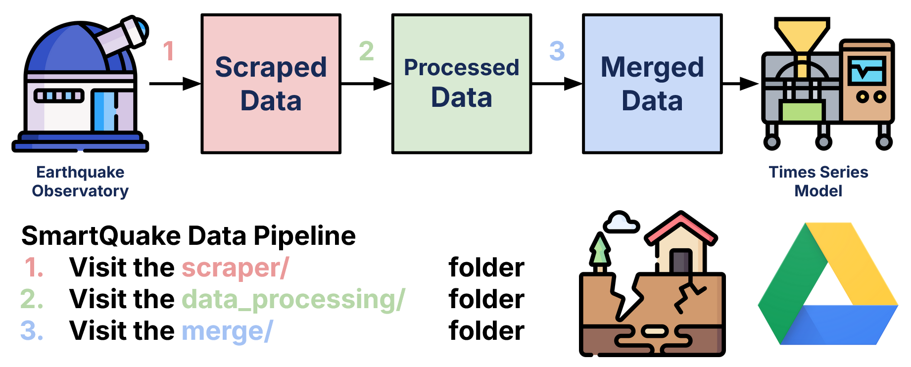

# **data_processing/ ⚙️**

This folder contains documentation on how to run data processing on the earthquake datasets used for the SmartQuake earthquake forecasting project.

## **What does this folder do? 📁**

Data processing is the **second step** of the SmartQuake data pipeline as shown above. After scraping all the datasets from the set of selected earthquake observatories, we need to compile all the CSVs into a standardized format, such that all datasets share the exact same columns.

Running data processing ensures that all SmartQuake earthquake CSVs have these 5 columns:

- **Timestamp ⏱️**
  - Stored as a `pd.Timestamp` string formatted as (YYYY-MM-DD HH:MM:SS.millisecond+00:00)
  - All times are set to UTC
  - Example: (2016-06-17 03:31:29.459000+00:00)
- **Magnitude 📈**
  - Uses **moment** magnitude (Mw)
  - No other magnitude types are included (e.g., Md, Richter)
- **Latitude 🌏**
  - Guaranteed to be within [-90, 90]
- **Longitude 🌍**
  - Guaranteed to be within [-180, 180]
- **Depth 📏**
  - Represented in kilometers (km)
  - For example, `depth=2.6` means the earthquake occurred 2.6 km below sea level.
  - **Warning:** This is an "optional" column, meaning that NOT all rows have a depth value. In other words, it's possible for `depth=None`, especially for older earthquake records (i.e., pre-20th century).

Furthermore, all datasets store earthquakes in **chronological order**, and feature **no duplicates** within each individual CSV.

## **File Organization 📜**

The `data_processing/` folder has two key files and one key folder that are required to run the data processing code.

- [data_processor.py](data_processor.py):
  - Contains the `DataProcessor` class that handles standardizes data processing for all datasets with just one function.
- [run_processor.py](run_processor.py):
  - Runs the `DataProcessor` functions for all scraped datasets.
- **processed/**: 
  - Folder that contains the processed output datasets (CSVs)
  - If, for some reason, this folder doesn't exist, make sure to create one.

## **Running Data Processing 🏃**

Data processing is a simple process that involves verifying input and output paths, and simply running a Python file.

### **Step 1: Compiling the Scraped Datasets**

The `data_processing/` folder assumes that the scraper code has already been run. If not, read the `scraper/` folder [`README.txt`](../scraper/README.md) first. Before moving to the next step, make sure that all `clean` datasets have the required datasets as expected.

### **Step 2: Confirm the processed/ folder exists**

The `processed/` folder will contain the output files that convert scraped datasets into processed datasets. Make sure that `data_processing/processed/` exists, or you'll likely run into a runtime error.

### **Step 3: Run run_processor.py**

If all the input and output filepaths were linked properly, then `run_processor.py` should be able to call the `DataProcessor` class and ensure that all datasets have the same 5 columns as described prior.

### **Step 4: Completion**

Confirm that all your CSVs exist in the `processed/` folder after running the data processing code. Afterwards, you should be able to move on to the next step of the data pipeline: merging datasets.

## **Credits and Contact: ☎️**

If you have problems running data processing, reach out to [Luke Nam](mailto:luke.nam@duke.edu), the author of both the `README.md` and the `DataProcessor` class.
