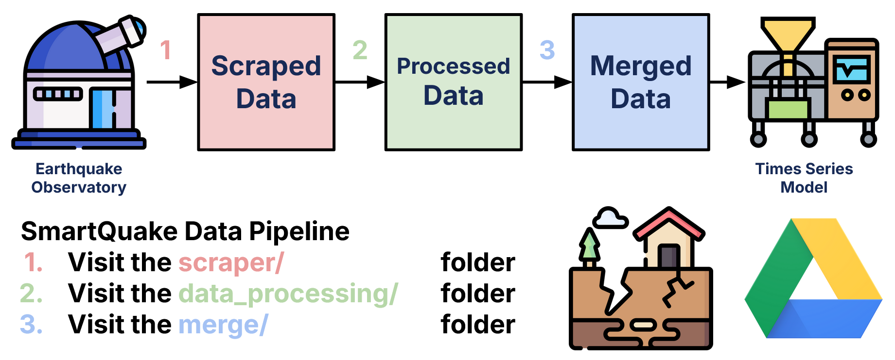

# **merge/ ⚙️**

This folder contains documentation on how to run merge the data-processed earthquake datasets used for the SmartQuake earthquake forecasting project.

## **What does this folder do? 📁**

Merging is the **third step** of the SmartQuake data pipeline as shown above. After processing all the datasets from the set of selected earthquake observatories, we need to merge all the CSVs into one big file, which can thne serve as input data for a machine learning model.

Running the merge code preserves the same 5 columns featured in the data processing datasets. Once again, the merged dataset stores earthquakes in **chronological order**, and features **no duplicates**.

## **File Organization 📜**

The `merge/` folder has four key files and two key folders that are required to run the data processing code.

- [helper.py](helper.py):
  - Provides helper functions for `merge.py`, mainly to merge multiple CSVs into one
- [merge.py](merge.py):
  - Merges all non-USGS/SAGE datasets into a CSV titled `Various-Catalogs.csv`
- **usgs_pre_1950/**: 
  - [usgs_merge.py](usgs_pre_1950/usgs_merge.py):
    - Merges USGS datasets into one CSV
  - [preprocess.py](usgs_pre_1950/preprocess.py):
    - Preprocesses USGS datasets before running `usgs_merge.py`
- **final/**:
  - [usgs_sage_various_merge.py](final/usgs_sage_various_merge.py):
    - Merges non-USGS/SAGE dataset with the USGS/SAGE dataset
    - Outputs `Completed-Merge.csv`, which can be used for machine learning model input

## **Running Merge 🏃**

Data processing is a simple process that involves verifying input and output paths, and simply running a Python file.

### **Step 1: Compiling the Processed Datasets**

Ensure that all processed datasets are contained in the `data_processing/processed/` directory. This filepath should not contain any USGS or SAGE datasets. If you have not either [scraped](../scraper/README.md) or [processed](../data_processing/README.md) the code, complete both steps before doing so.

### **Step 2: First Merge**

Run `merge.py` to merge the datasets in the `processed/` folder. This should combine all of those datasets into a file titled `Various-Catalogs.csv`.

### **Step 3: Processing and Merging USGS Data**

Now that all the non-USGS/SAGE data has been compiled into one dataset, we now have to process and merge the USGS data. Download the [USGS](https://drive.google.com/drive/folders/1mcT7pdQ73oZAeLJR5NoC4HtXwkFjOCH9?usp=drive_link) and [SAGE](https://drive.google.com/drive/folders/1A1qYsD_WXZRmvcUdYRn-JbqdMk3sVC3O?usp=drive_link) datasets from the Google Drive and store the files in `merge/usgs_pre_1950`. Then, run `preprocess.py` and `merge.py` to create `USGS_SAGE_Merged.csv`.

If you want to speed this process, or have run into any bugs, you can skip this step by visiting the Google Drive to and directly downloading [`USGS_SAGE_Merged.csv`](https://drive.google.com/file/d/1vZxxrXIYR7K7YWcuJUe4HGYJH8vDCTpX/view?usp=drive_link). Store the file in `merge/final/` for the next step.

### **Step 4: Final Merge**

Now that you have both the non-USGS/SAGE dataset and the USGS/SAGE dataset, you can run `usgs_sage_various_merge.py` to merge the two datasets together. The script uses a two-pointer approach to merge the two datasets into a combined file titled `Completed-Merge.csv`. This dataset can then be used to serve as input data for machine learning models.

## **Credits and Contact: ☎️**

If you have problems running the merge code, reach out to [Luke Nam](mailto:luke.nam@duke.edu), the author of this `README.md` and the code for merging the non-USGS/SAGE datasets.

